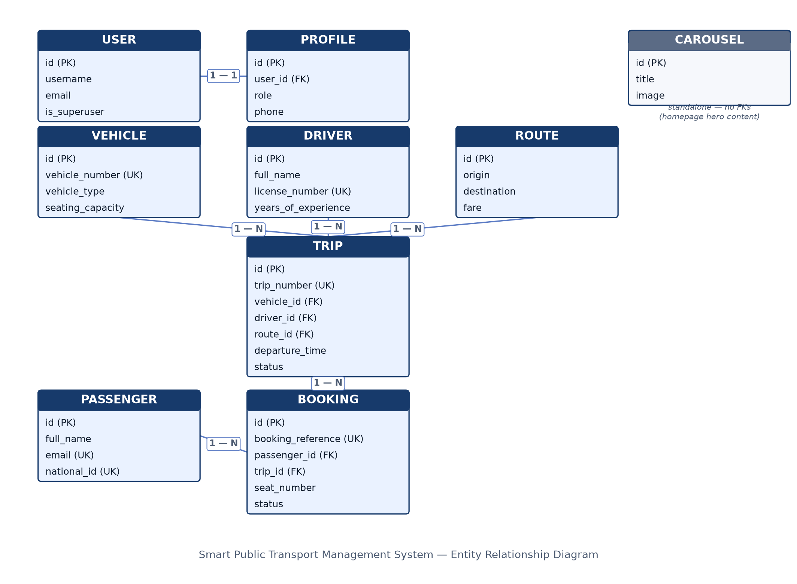
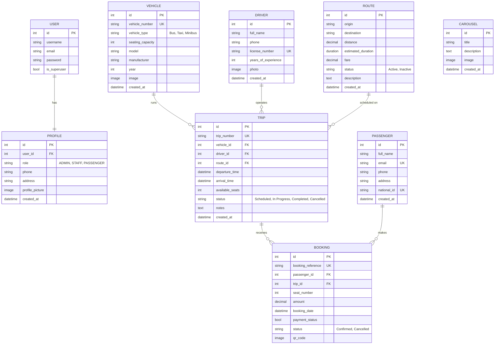

# Data Model — Smart Public Transport Management System

This document covers Section A of the exam brief: the Entity Relationship
Diagram, the full database schema as implemented, and what each entity
represents. The schema below is not a proposal — it is a direct description
of the Django models already migrated into `db.sqlite3` (see each app's
`models.py` and `migrations/`).

## 1. Entity Relationship Diagram

Same diagram, as Mermaid source (renders natively on GitHub too):

`CAROUSEL` has no foreign keys — it is standalone homepage content (hero
images shown to visitors) and is intentionally not part of the operational
domain graph above.

## 2. Schema — tables as implemented

| Table (Django model) | App | Key columns | Constraints |
|---|---|---|---|
| `auth_user` | Django built-in | `username`, `email`, `password`, `is_superuser`, `is_staff` | `username` unique |
| `accounts_profile` | accounts | `user_id`, `role`, `phone`, `address`, `profile_picture` | `user_id` OneToOne → `auth_user`; `role` restricted to `ADMIN`/`STAFF`/`PASSENGER` |
| `passengers_passenger` | passengers | `full_name`, `email`, `phone`, `address`, `national_id` | `email` unique, `national_id` unique |
| `drivers_driver` | drivers | `full_name`, `phone`, `license_number`, `years_of_experience`, `photo` | `license_number` unique |
| `vehicles_vehicle` | vehicles | `vehicle_number`, `vehicle_type`, `seating_capacity`, `model`, `manufacturer`, `year`, `image` | `vehicle_number` unique; `vehicle_type` ∈ {Bus, Taxi, Minibus} |
| `routes_route` | routes | `origin`, `destination`, `distance`, `estimated_duration`, `fare`, `status`, `description` | `status` ∈ {Active, Inactive} |
| `trips_trip` | trips | `trip_number`, `vehicle_id`, `driver_id`, `route_id`, `departure_time`, `arrival_time`, `available_seats`, `status`, `notes` | `trip_number` unique; FKs → Vehicle, Driver, Route (`on_delete=CASCADE`); `status` ∈ {Scheduled, In Progress, Completed, Cancelled} |
| `bookings_booking` | bookings | `booking_reference`, `passenger_id`, `trip_id`, `seat_number`, `amount`, `booking_date`, `payment_status`, `status`, `qr_code` | `booking_reference` unique (auto-generated `BK00001`…); FKs → Passenger, Trip (`on_delete=CASCADE`); one seat per trip enforced in `bookings/views.py` |
| `carousel_carousel` | carousel | `title`, `description`, `image` | none |

## 3. What each entity represents

**User / Profile** — `User` is Django's built-in authentication record
(login credentials). `Profile` extends it 1:1 (auto-created via a
`post_save` signal in `accounts/signals.py`) and carries the one field the
whole authorization model hinges on: `role`. `ADMIN` gets the Django admin,
`STAFF` gets the operations dashboard, `PASSENGER` gets the public booking
flow — `accounts/views.py` routes login by this field.

**Passenger** — a rider profile, distinct from `User`. Kept separate
because passengers can be recorded by staff (e.g. walk-in bookings) without
every passenger needing a login account.

**Driver** — the person assigned to operate a vehicle on a trip. Holds
licensing data (`license_number`) used to keep trips legally staffed.

**Vehicle** — a physical bus/taxi/minibus in the fleet, with seating
capacity, which directly caps how many bookings a `Trip` on that vehicle
can accept.

**Route** — a fixed origin→destination path with a fare and expected
duration. Routes are reusable: many trips run the same route on different
days/times.

**Trip** — one scheduled departure: a specific `Vehicle` + `Driver` running
a specific `Route` at a specific time. `available_seats` is decremented on
every confirmed booking and incremented back on cancellation, so it always
reflects live capacity.

**Booking** — a passenger's reservation of one seat on one trip. Generates
a unique reference and a scannable QR ticket on save (`generate_qr_code` in
`bookings/models.py`). The seat-uniqueness and overbooking checks in
`bookings/views.py` are the actual business rule enforcing "one seat, one
passenger, one trip."

**Carousel** — homepage hero content (image + caption) shown to visitors
before login; purely presentational, no operational relationships.

## 4. Relationship summary

- **User 1—1 Profile**: every account has exactly one role.
- **Vehicle 1—N Trip**, **Driver 1—N Trip**, **Route 1—N Trip**: a trip is
  the junction where a vehicle, a driver and a route meet for one
  scheduled run.
- **Trip 1—N Booking**, **Passenger 1—N Booking**: a booking is the
  junction where a passenger claims one seat on one trip. `Booking` is
  effectively the many-to-many resolver between `Passenger` and `Trip`,
  carrying its own attributes (seat, amount, status, QR code).
