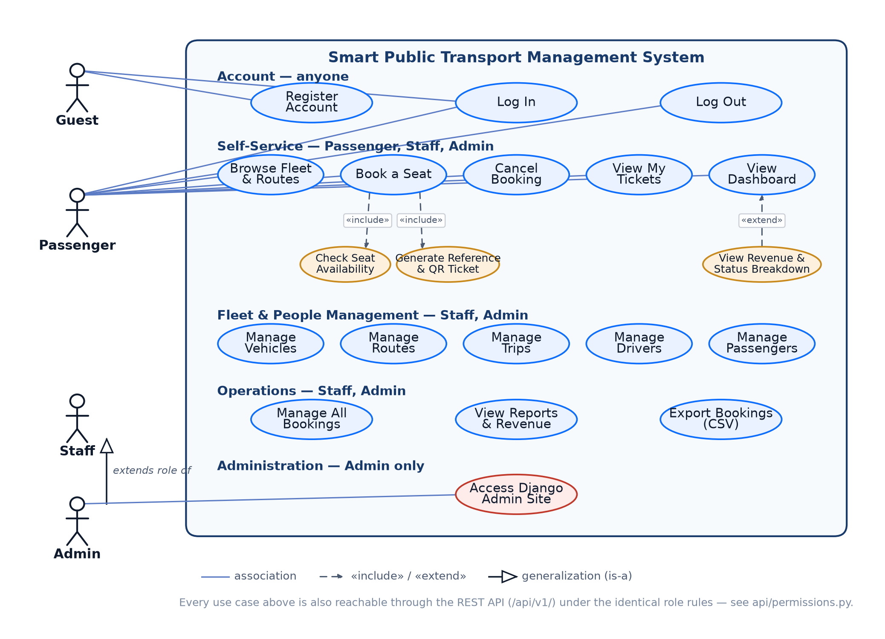

# Use Case Diagram — Smart Public Transport Management System

Companion to [`docs/ERD.md`](ERD.md) (the data model) — this covers the
*behavioural* view: who can do what, and how a few of the more
interesting use cases are actually built.

## 1. Actors

| Actor | Who | Maps to |
|---|---|---|
| **Guest** | Anyone not signed in | No account |
| **Passenger** | A rider | `Profile.role = "PASSENGER"` |
| **Staff** | Operations staff | `Profile.role = "STAFF"` |
| **Admin** | System administrator | `Profile.role = "ADMIN"` or `is_superuser` |

`Admin` **generalizes** `Staff` in the diagram (the hollow-triangle
arrow) — every use case Staff can perform, Admin can too, plus the
Django admin site exclusively. This mirrors `is_staff_or_admin()` in
[`accounts/decorators.py`](../accounts/decorators.py), the single
function both the HTML views and the API's permission classes call.

## 2. Use cases by group

**Account (anyone)** — Register Account, Log In, Log Out.

**Self-Service (Passenger, Staff, Admin)** — Browse Fleet & Routes,
Book a Seat, Cancel Booking, View My Tickets, View Dashboard. This is
the only group where the diagram draws individual actor lines, since
this is where the per-actor differences actually matter: a Guest gets
none of it (must register/log in first); a Passenger's bookings and
tickets are scoped to their own account
(`bookings/views.py::_can_manage_booking`); Staff/Admin implicitly get
the same self-service actions plus everything in the groups below.

**Fleet & People Management (Staff, Admin only)** — Manage Vehicles,
Manage Routes, Manage Trips, Manage Drivers, Manage Passengers. Grouped
under one role label rather than drawn with individual lines to keep
the diagram legible — the point that matters (who can reach this group
at all) is the same for all five.

**Operations (Staff, Admin only)** — Manage All Bookings, View Reports
& Revenue, Export Bookings (CSV).

**Administration (Admin only)** — Access Django Admin Site.

## 3. Why the include/extend relationships are there

Not decorative — each one names a real mechanism in the code:

- **Book a Seat «include» Check Seat Availability** — every booking
  attempt runs the overbooking/duplicate-seat checks in
  [`bookings/services.py::create_booking`](../bookings/services.py)
  before anything is saved. This isn't optional or conditional, which
  is exactly what `«include»` means: it happens on every execution of
  the base use case.
- **Book a Seat «include» Generate Reference & QR Ticket** — the same
  function also always generates the `BK#####` reference and (via
  `Booking.save()`) the scannable QR ticket. Two separate include
  arrows because they're two distinct, independently-nameable steps,
  not because they happen at different times.
- **View Revenue & Status Breakdown «extend» View Dashboard** — this
  is a conditional addition, not a guaranteed step, which is what
  `«extend»` means (as opposed to `«include»`): a Passenger's dashboard
  is just the base use case; a Staff/Admin dashboard is the base use
  case *plus* this extension. See
  [`dashboard/views.py`](../dashboard/views.py) — `show_operations_panel`
  is set only `if is_staff_or_admin(request.user)`, and the template
  branches on exactly that flag.

## 4. One more access path, not shown as a separate actor

Every use case above is also reachable through the REST API at
`/api/v1/`, under the identical role rules —
[`api/permissions.py`](../api/permissions.py) is built on the same
`is_staff_or_admin()` check as the HTML views. It's deliberately not
drawn as a second actor lane: the *business* use cases are the same
regardless of which interface reaches them, and duplicating the whole
diagram to show "the same things, but via HTTP JSON instead of HTML"
would add clutter without adding information. See the API reference
table in the [README](../README.md#rest-api) instead.
